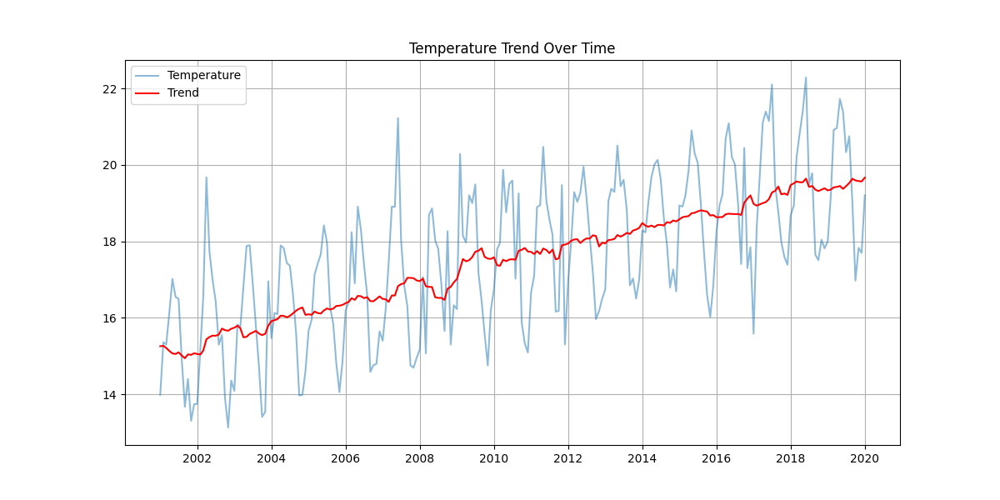
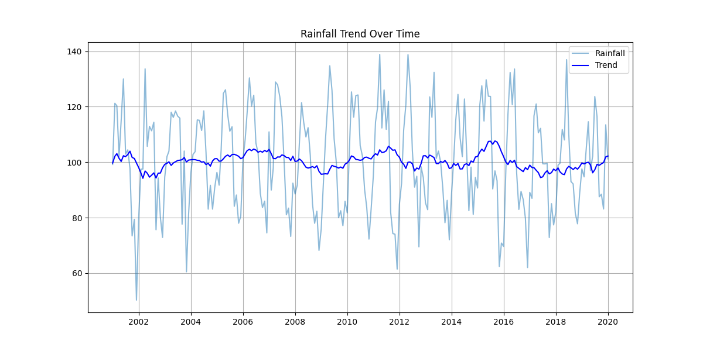
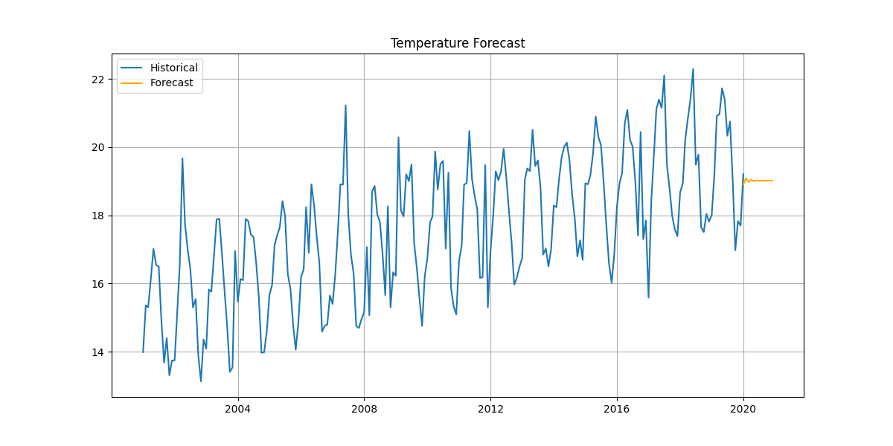
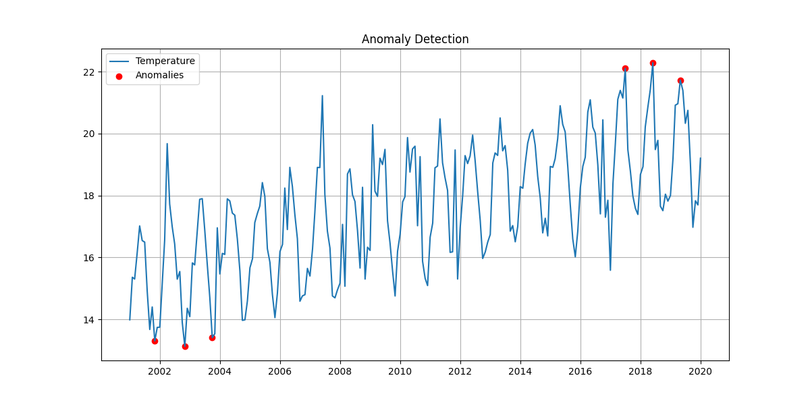
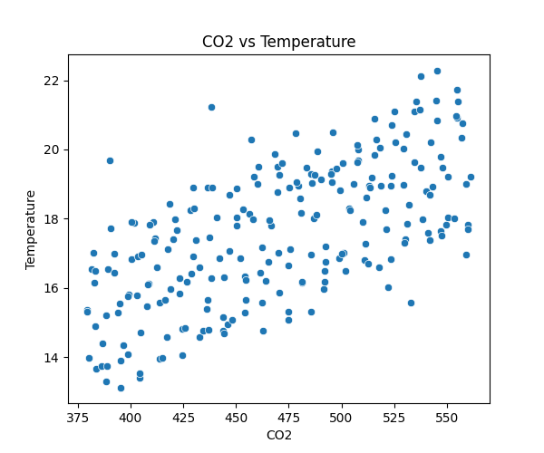

# 🌍 Climate Trend Analyzer

> A complete end-to-end climate data analytics project that analyzes trends, detects anomalies, and forecasts future climate conditions using time-series modeling.

---

## 🖥 Dashboard Preview


---

## 📌 Project Overview

The **Climate Trend Analyzer** is an industry-oriented data science project designed to analyze historical climate data and uncover meaningful insights such as long-term trends, seasonal patterns, anomalies, and future forecasts.

This project simulates real-world workflows used by climate researchers, environmental analysts, and sustainability organizations to transform raw environmental data into actionable intelligence.

---

## 🎯 Problem Statement

Climate data is complex, multi-dimensional, and spans long time periods. Raw datasets are often:

* Noisy
* Incomplete
* Difficult to interpret

This project solves:

* Extracting trends from time-series data
* Detecting abnormal climate behavior
* Forecasting future climate conditions

---

## 🎯 Objectives

* Analyze temperature, rainfall, and CO₂ trends
* Identify seasonal patterns
* Detect anomalies using statistical methods
* Forecast temperature using ARIMA
* Build an interactive dashboard

---

## 🧠 Methodology

### 1. Data Collection

Synthetic dataset simulating real-world climate parameters:

* Temperature (°C)
* Rainfall (mm)
* CO₂ (ppm)
* Sea Level (mm)

---

### 2. Data Preprocessing

* Handling missing values
* Date-time conversion
* Sorting time-series data
* Outlier filtering

---

### 3. Feature Engineering

* Year & Month extraction
* Seasonal classification
* Lag features
* Rolling averages

---

### 4. Exploratory Data Analysis

* Temperature trends
* Rainfall patterns
* CO₂ vs Temperature relationship
* Seasonal variations

---

### 5. Trend Analysis

* Linear regression to detect warming trend
* Slope used as climate indicator

---

### 6. Anomaly Detection

* Z-score based detection
* Identifies extreme climate events

---

### 7. Forecasting

* ARIMA model for time-series prediction
* Future temperature estimation

---

### 8. Visualization Dashboard

* Built using Streamlit
* Interactive charts and KPIs

---

## 🛠 Tech Stack

| Category         | Tools                       |
| ---------------- | --------------------------- |
| Programming      | Python                      |
| Data Analysis    | Pandas, NumPy               |
| Visualization    | Matplotlib, Seaborn, Plotly |
| Machine Learning | Scikit-learn                |
| Time Series      | Statsmodels (ARIMA)         |
| Dashboard        | Streamlit                   |

---

## 📊 Project Architecture

```text
Raw Data → Preprocessing → Feature Engineering → EDA → Trend Analysis → Anomaly Detection → Forecasting → Dashboard
```

---

## 📁 Folder Structure

```text
Climate-Trend-Analyzer/
│
├── app/                  # Streamlit dashboard
├── data/raw/             # Dataset
├── src/                  # Core modules
├── outputs/plots/        # Visualizations
├── outputs/dashboard.png # Dashboard image
├── main.py
├── requirements.txt
└── README.md
```

---

## ▶️ How to Run

```bash
pip install -r requirements.txt
streamlit run app/app.py
```

---

## 📈 Results & Insights

* Rising temperature trend detected
* Seasonal rainfall variation observed
* Climate anomalies identified
* Forecast indicates continued warming

---

## 📊 Visual Insights

### 🌡 Temperature Trend

Shows long-term warming pattern.



---

### 🌧 Rainfall Trend

Seasonal rainfall variation over time.



---

### 📈 Forecasted Temperature

Future prediction using ARIMA model.



---

### ⚠️ Anomaly Detection

Detected abnormal temperature spikes.



---

### 🌍 CO₂ vs Temperature Correlation

Relationship between CO₂ levels and temperature.



---

## 💡 Key Learnings

* Time-series data handling
* Feature engineering for temporal data
* Trend analysis using regression
* Anomaly detection using statistics
* Forecasting using ARIMA
* Dashboard development using Streamlit

---

## 🚀 Project Highlights

✔ End-to-End Data Science Pipeline
✔ Realistic Climate Simulation
✔ Time-Series Forecasting
✔ Interactive Dashboard
✔ Industry-Relevant Use Case

---

## 🌐 Demo

Run locally:

```bash
streamlit run app/app.py
```

---

## 🚀 Future Improvements

* Region-wise analysis
* Real-time API integration
* Advanced models (Prophet, LSTM)
* Geospatial visualization
* Climate risk scoring

---

## 💼 Industry Relevance

Applicable in:

* Environmental Analytics
* Climate Research
* ESG & Sustainability
* Smart City Planning
* Agriculture Risk Analysis

---

## 👨‍💻 Author

**Sujal Kumar Shaw**
🎓 B.Tech Student | Aspiring Data Scientist
📊 Interested in Data Science, Climate Analytics & AI

🔗 GitHub: https://github.com/sujalkrshaw
