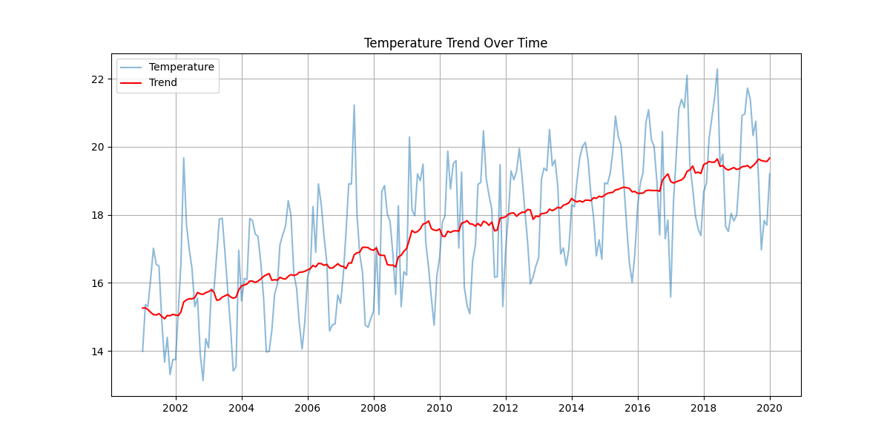
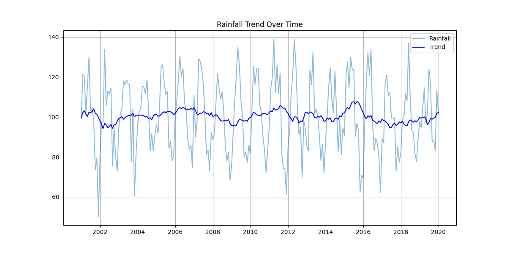
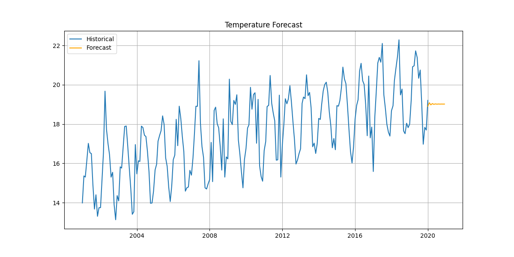
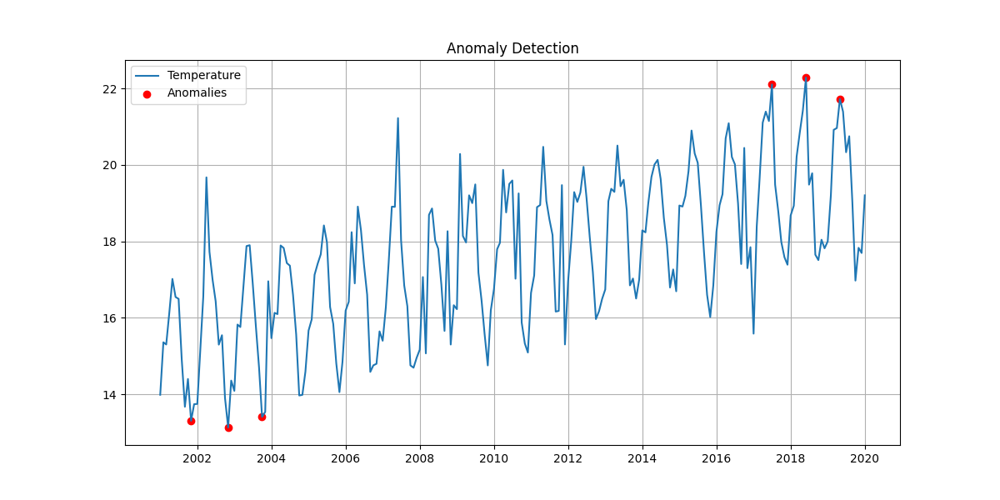
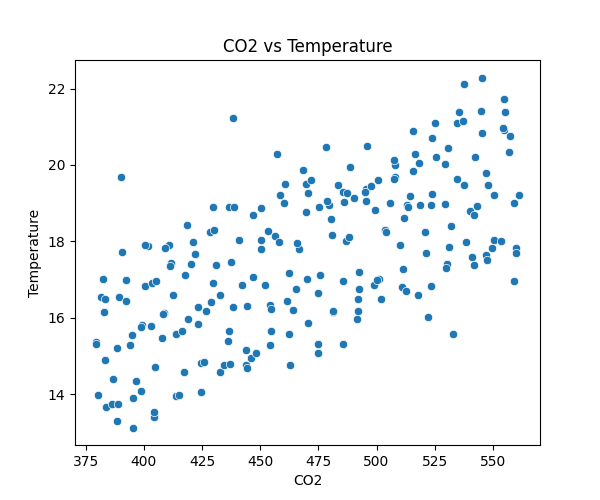

# 🌍 AI Climate Trend Analyzer & Forecasting Dashboard

<p align="center">
  
  
  
  
  
</p>

<h1 align="center">🌍 Climate Trend Analyzer</h1>

<p align="center">
📊 AI-Powered Climate Analytics, Forecasting & Environmental Intelligence Dashboard
</p>

---

# 🌐 Live Demo

## 🚀 Open Live Dashboard

👉 https://climate-trend-analyzer-wtmmej4mhncjpwmuc2yewp.streamlit.app/

---

# 🖥 Dashboard Preview


---

# 📌 Project Overview

The AI Climate Trend Analyzer is an advanced Data Science and Time-Series Forecasting project designed to analyze historical climate data, identify environmental trends, detect anomalies, and forecast future climate conditions.

This project simulates real-world environmental analytics systems used by:

- 🌍 Climate Researchers
- 📊 Environmental Analysts
- 🏙 Smart City Planners
- 🌱 Sustainability Organizations
- 🌾 Agricultural Risk Analysts

The dashboard transforms raw climate data into meaningful visual insights using AI-powered analytics and forecasting models.

---

# ❗ Problem Statement

Climate datasets are highly complex, noisy, and multi-dimensional.

Traditional climate analysis methods often fail to:

- 📉 Detect long-term environmental changes
- 🌡 Identify abnormal climate events
- 📊 Visualize climate patterns effectively
- 🔮 Predict future climate conditions

This project solves these challenges using Machine Learning, Statistical Analysis, and Time-Series Forecasting techniques.

---

# 🎯 Project Objectives

✅ Analyze temperature trends  
✅ Monitor rainfall patterns  
✅ Study CO₂ emission impact  
✅ Detect climate anomalies  
✅ Forecast future temperature trends  
✅ Build an interactive analytics dashboard  
✅ Visualize environmental insights  

---

# 🧠 AI Features

The dashboard includes advanced AI-powered analytics such as:

- 🌡 Temperature Trend Analysis
- 🌧 Rainfall Pattern Analysis
- 📈 Climate Forecasting
- ⚠️ Anomaly Detection
- 🌍 CO₂ Correlation Analysis
- 📊 Time-Series Visualization
- 🔮 Future Climate Prediction

---

# 🧪 Methodology

## 1️⃣ Data Collection

Synthetic dataset simulating real-world climate parameters:

- 🌡 Temperature (°C)
- 🌧 Rainfall (mm)
- 🏭 CO₂ Levels (ppm)
- 🌊 Sea Level (mm)

---

## 2️⃣ Data Preprocessing

- Handling missing values
- Date-time conversion
- Sorting time-series data
- Outlier filtering

---

## 3️⃣ Feature Engineering

- Year & Month extraction
- Seasonal classification
- Lag feature creation
- Rolling average generation

---

## 4️⃣ Exploratory Data Analysis

- Temperature trends
- Rainfall variation
- CO₂ vs Temperature relationship
- Seasonal climate analysis

---

## 5️⃣ Trend Analysis

Linear Regression used for identifying warming trends and climate indicators.

---

## 6️⃣ Anomaly Detection

Z-score based anomaly detection for identifying extreme climate events.

---

## 7️⃣ Forecasting

ARIMA model used for future temperature forecasting.

---

## 8️⃣ Interactive Dashboard

Built using Streamlit with professional data visualizations and KPI cards.

---

# 📊 Dashboard Features

## 📌 KPI Cards

The dashboard displays:

- 🌡 Average Temperature
- 🌧 Total Rainfall
- 📈 CO₂ Growth
- ⚠️ Climate Anomalies

---

## 📊 Interactive Visualizations

### 🌡 Temperature Trend Analysis

Long-term warming pattern visualization.



---

### 🌧 Rainfall Trend Analysis

Seasonal rainfall variation monitoring.



---

### 📈 Forecasted Temperature

Future climate prediction using ARIMA forecasting.



---

### ⚠️ Climate Anomaly Detection

Detection of abnormal climate spikes.



---

### 🌍 CO₂ vs Temperature Correlation

Relationship between greenhouse gases and temperature rise.



---

# 🧠 AI Workflow

```text
Climate Data
      ↓
Data Preprocessing
      ↓
Feature Engineering
      ↓
EDA & Visualization
      ↓
Trend Analysis
      ↓
Anomaly Detection
      ↓
ARIMA Forecasting
      ↓
Interactive Dashboard
```

---

# ⚙️ Technologies Used

| Technology | Purpose |
|---|---|
| Python | Core Programming |
| Pandas | Data Analysis |
| NumPy | Numerical Computing |
| Matplotlib | Visualization |
| Seaborn | Statistical Visualization |
| Plotly | Interactive Charts |
| Scikit-learn | Machine Learning |
| Statsmodels | ARIMA Forecasting |
| Streamlit | Dashboard Development |
| GitHub | Version Control |
| Streamlit Cloud | Deployment |

---

# 📂 Project Structure

```text
Climate-Trend-Analyzer/
│
├── app/                  # Streamlit dashboard
├── data/raw/             # Dataset
├── src/                  # Core modules
├── outputs/plots/        # Visualizations
├── outputs/dashboard.png # Dashboard preview
├── main.py
├── requirements.txt
└── README.md
```

---

# 🚀 Installation Guide

## 1️⃣ Clone Repository

```bash
git clone https://github.com/sujalkrshaw/climate-trend-analyzer.git
```

---

## 2️⃣ Open Project Folder

```bash
cd climate-trend-analyzer
```

---

## 3️⃣ Install Dependencies

```bash
pip install -r requirements.txt
```

---

## 4️⃣ Run Streamlit Dashboard

```bash
streamlit run app/app.py
```

---

# 🌐 Deployment

This project is deployed using Streamlit Community Cloud.

## 🚀 Live Website

https://climate-trend-analyzer-wtmmej4mhncjpwmuc2yewp.streamlit.app/

---

# 📈 Results & Insights

✔ Rising global temperature trend detected  
✔ Seasonal rainfall variation observed  
✔ Climate anomalies identified successfully  
✔ Forecast indicates continued warming trend  

---

# 🚀 Future Improvements

🔹 Real-time Weather API Integration  
🔹 Advanced Forecasting Models (LSTM, Prophet)  
🔹 Region-wise Climate Analytics  
🔹 Geospatial Visualization  
🔹 Climate Risk Prediction  
🔹 AI Climate Assistant  

---

# 💼 Industry Relevance

Applicable in:

- 🌍 Environmental Analytics
- 🌱 Climate Research
- 🏙 Smart City Planning
- 🌾 Agriculture Risk Analysis
- 📊 ESG & Sustainability Analytics

---

# 💡 Learning Outcomes

Through this project, I learned:

✅ Time-Series Data Analysis  
✅ Feature Engineering  
✅ Climate Data Analytics  
✅ ARIMA Forecasting  
✅ Statistical Anomaly Detection  
✅ Interactive Dashboard Development  
✅ Streamlit Deployment  

---

# 👨‍💻 Author

## Sujal Kumar Shaw

🎓 B.Tech Student | Aspiring Data Scientist

### 🚀 Interests

- 📊 Data Science
- 🌍 Climate Analytics
- 🤖 Artificial Intelligence
- 📈 Data Visualization

---

# 🔗 Project Links

## 🌐 Live Demo

https://climate-trend-analyzer-wtmmej4mhncjpwmuc2yewp.streamlit.app/

## 💻 GitHub

https://github.com/sujalkrshaw

---

# ⭐ Support

If you liked this project:

⭐ Star the repository  
🍴 Fork the project  
📢 Share the project  

---

# 📜 License

This project is developed for educational and portfolio purposes.

---

# 🚀 Final Note

This project demonstrates how AI, Machine Learning, Statistical Analysis, and Time-Series Forecasting can be combined to build intelligent environmental analytics systems capable of understanding climate patterns and forecasting future climate behavior.
